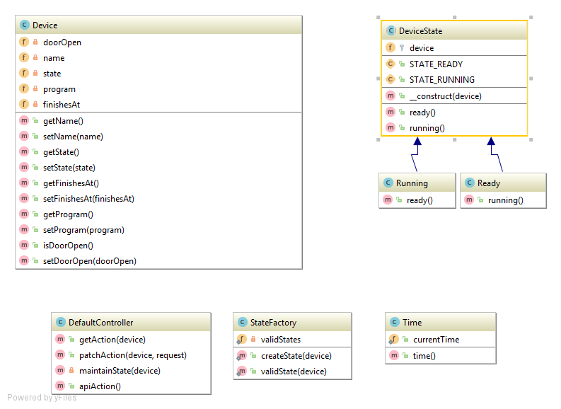

# Dishwasher API

Provides a simple API for a dishwasher.

Build on Symfony, using:
* Doctrine + Sqlite
* JMS Serializer
* nelmio/cors-bundle
* doctrine-fixtures-bundle

## API Documentation
Swagger file in /web/swagger.json or use the [dishwasher-docker](https://github.com/dom-mel/dishwasher-docker) and provided swagger ui.
 
## Structure

* A device is stored as `Device` as doctrine entity
* The State logic is modeled via state pattern in `DeviceState` and subclasses
* To create the right state of a device a `StateFactory` is provided
* API calls are build in the `DefaultController`
  * Reading a device is in the getAction
  * Changing a device is in the patchAction
  * apiAction provides the swagger documentation
* Time is used to be able to fake time in automated test
* Features are tested using Symfony web driver and doctrine fixtures to provide reproducible state.